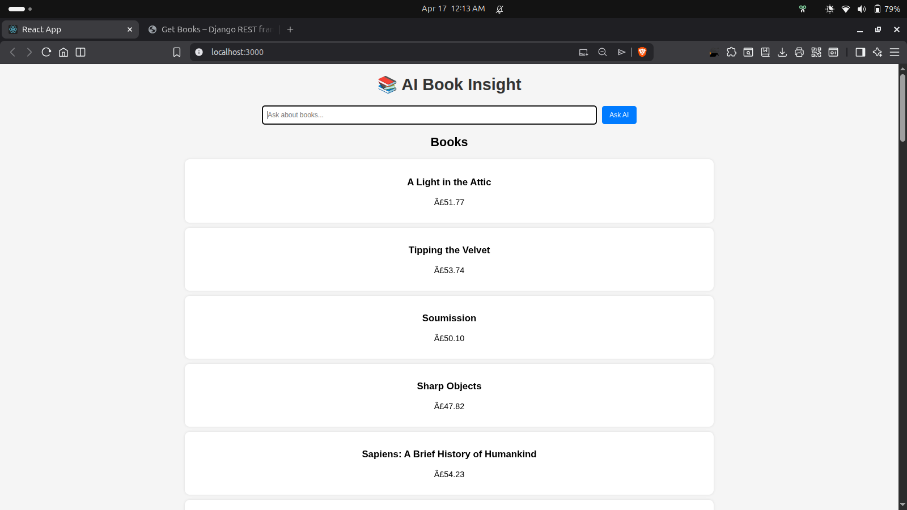
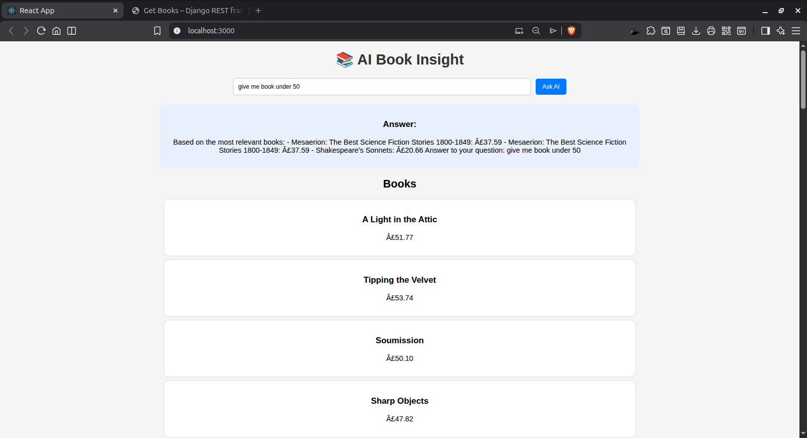
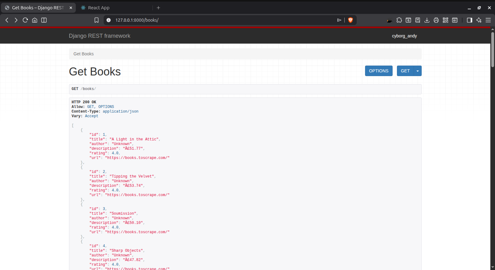
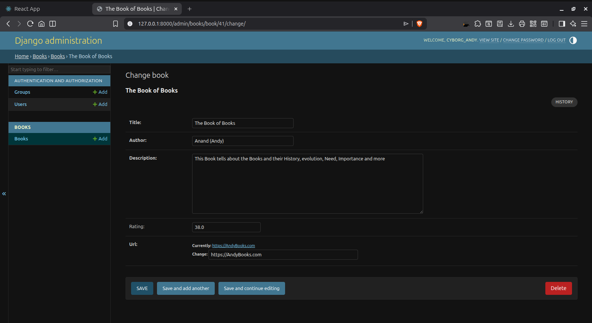

# 📚 AI-Powered Book Insight Platform

## Overview

This project is a full-stack web application that uses a simple AI pipeline to help users explore books and get relevant insights. It combines a Django-based backend with a React frontend and uses embedding-based retrieval to answer user queries about books.

The goal of this project is to demonstrate how Retrieval-Augmented Generation (RAG) concepts can be applied in a practical, lightweight setup.

---

## Features

- Browse a list of books with details  
- Ask questions related to books  
- Retrieve relevant results using semantic similarity  
- Basic recommendation functionality  
- REST API built with Django REST Framework  
- Simple and responsive React frontend  

---

## Tech Stack

**Backend**
- Django  
- Django REST Framework  
- SQLite  
- Sentence Transformers  

**Frontend**
- ReactJS  
- JavaScript (Fetch API)  

**AI / ML**
- SentenceTransformer (`all-MiniLM-L6-v2`)  
- Cosine similarity for retrieval  

---

## Project Structure

```
backend/
  ├── books/
  ├── backend/
  ├── manage.py
  ├── requirements.txt

frontend/
  ├── src/
  ├── public/

venv/
README.md
```

---

## Setup Instructions

### 1. Clone the Repository

```
git clone https://github.com/Andycyborg/ai-book-insight-platform.git
```

---

### 2. Backend Setup

```
cd backend
python3 -m venv venv
source venv/bin/activate
pip install -r requirements.txt
python manage.py runserver
```

---

### 3. Frontend Setup

```
cd frontend
npm install
npm start
```

---

## API Endpoints

| Method | Endpoint     | Description              |
|--------|--------------|--------------------------|
| GET    | /books/      | Retrieve all books       |
| POST   | /ask/        | Submit a question        |
| GET    | /recommend/  | Get recommended books    |

---

## How It Works

- User submits a query  
- The query is converted into an embedding  
- Stored book data is also represented as embeddings  
- Cosine similarity is used to find relevant matches  
- The system returns results based on the closest matches  

---

## 📸 Screenshots

### 📚 Book List



### ❓ Ask Question



### 🤖 Answer Output


### 📚 Book Api


 
 ### ⚙️ Django Admin Panel (Database) - Book Data Management


---

##  Sample Questions

* "cheap books"
* "books under 50"
* "Based on the most relevant books: - Mesaerion: The Best Science Fiction Stories 1800-1849: £37.59 - Mesaerion: The Best Science Fiction Stories 1800-1849: £37.59 - Shakespeare's Sonnets: £20.66 Answer to your question: give me the book under 50"

---

## Limitations

- Responses are based on similarity, not full language generation  
- No user authentication or personalization  
- Limited dataset scope  

---

## Future Improvements

- Integrate a more advanced language model for better responses  
- Add user authentication  
- Store query history  
- Improve UI design  

---

## Author

Tania Ray
